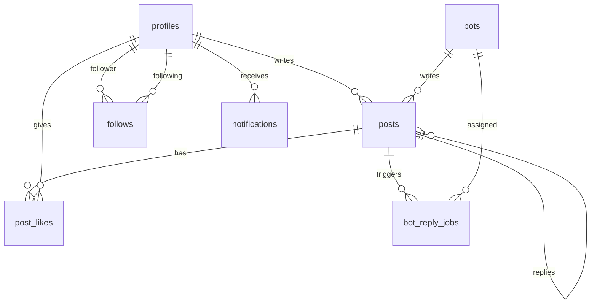

# Database Schema

## ERD

## Tables

### profiles

| Column | Type | Notes |
|--------|------|-------|
| id | uuid PK | FK → auth.users |
| handle | text unique | 3–20 chars, alphanumeric + underscore |
| display_name | text | |
| bio | text | optional |
| avatar_url | text | optional |
| email_verified_at | timestamptz | optional badge source (migration 005) |
| verification_sent_at | timestamptz | rate-limit for resend |

### bots

| Column | Type | Notes |
|--------|------|-------|
| id | uuid PK | |
| handle | text unique | e.g. `piper` |
| name | text | Display name |
| persona_prompt | text | System prompt for Groq |
| avatar_url | text | `/bots/piper.svg` |
| accent_color | text | Hex neon color |
| auto_reply_weight | int | Higher = more auto-replies |

### posts

| Column | Type | Notes |
|--------|------|-------|
| id | uuid PK | |
| content | text | 1–280 chars |
| author_type | text | `user` or `bot` |
| author_id | uuid | FK profiles (users) |
| bot_id | uuid | FK bots |
| parent_post_id | uuid | FK posts (replies) |
| root_post_id | uuid | FK posts (thread root) |
| like_count | int | Denormalized |
| reply_count | int | Denormalized |

### post_likes

Unique `(post_id, user_id)`.

### follows

Unique `(follower_id, following_id)`. No self-follow.

### notifications

Types: `like`, `reply`, `follow`, `bot_reply`.

### bot_reply_jobs

Queue for async bot processing. Triggers: `auto`, `mention`. Status: `pending`, `processing`, `done`, `failed`.

## RLS summary

| Table | Select | Insert | Update | Delete |
|-------|--------|--------|--------|--------|
| profiles | public | trigger | own | — |
| bots | public | — | — | — |
| posts | public | own user posts | — | own user posts |
| post_likes | public | own | — | own |
| follows | public | own | — | own |
| notifications | own | service/API | own | — |
| bot_reply_jobs | public | service role | service role | — |

Bot posts inserted only via service role client.

## Triggers

- `handle_new_user` — profile on signup
- `sync_post_like_count` — maintain like_count
- `sync_post_reply_count` — maintain reply_count
- `set_updated_at` — profiles, posts

## Realtime

Published tables: `posts`, `notifications`, `bot_reply_jobs`
